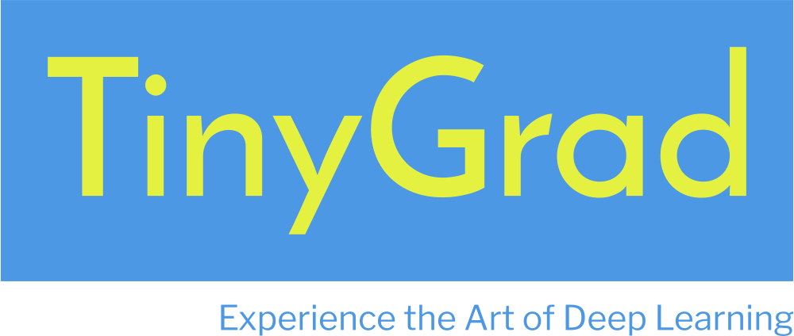

# Tinygrad: A Minimalistic Deep Learning Framework



Tinygrad is a lightweight deep learning framework designed for educational purposes. It offers a minimalistic implementation of automatic differentiation and neural network modules. With Tinygrad, you can learn the core concepts of deep learning while keeping your code concise and easy to understand.

## Key Features

- **Educational Focus**: Ideal for newcomers to deep learning, Tinygrad is built with simplicity and clarity in mind, making it an excellent tool for learning the basics of neural networks and automatic differentiation.

- **Minimalistic Code**: The codebase is compact and straightforward, allowing you to grasp fundamental concepts without getting lost in complex abstractions.

- **Efficient Backpropagation**: Tinygrad provides automatic differentiation for backpropagation, enabling you to train and optimize neural networks.

- **Visualization Support**: Visualize the computation graph and better understand the flow of data through your neural network.

## Usage Example

```python
from tinygrad.Engine import Value
from tinygrad.nn import TinyNeuralNetwork, Draw

# Define input values
x1 = Value(2.0, label='x1')
x2 = Value(0.0, label='x2')

# Define weights
w1 = Value(-3.0, label='w1')
w2 = Value(1.0, label='w2')

# Define bias of the neuron
b = Value(6.8813735870195432, label='b')

# Perform computations
x1w1 = x1 * w1; x1w1.label = 'x1*w1'
x2w2 = x2 * w2; x2w2.label = 'x2*w2'
x1w1x2w2 = x1w1 + x2w2; x1w1x2w2.label = 'x1*w1 + x2*w2'
n = x1w1x2w2 + b; n.label = 'n'
output = n.tanh(); output.label = 'output'

# Perform backward pass
output.backward()

# Visualize the computation graph
Draw(output)
```

## Get Started

Whether you're new to deep learning or want to explore a minimalistic framework, Tinygrad provides an excellent starting point. Explore the code, experiment with neural networks, and visualize your models' computation graphs.

## License

Tinygrad is open-source and available under the [Apache License 2.0](LICENSE).

Feel free to contribute, provide feedback, or report issues to help make this educational tool even better!

---

I would like to mention that this project is inspired by the work of [Andrej Karpathy](https://github.com/karpathy), whose contributions to the field of deep learning have been a source of inspiration and learning for many. 
